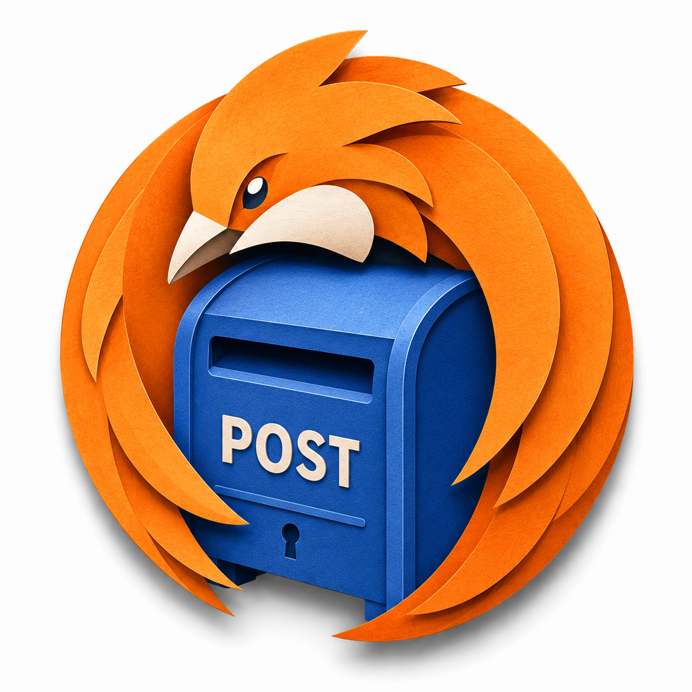
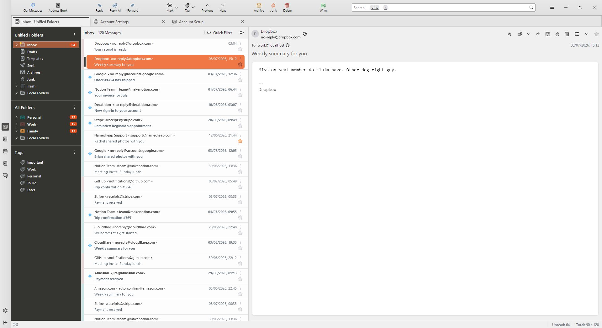

<div align="center">



# Postbird

**A [Postbox](https://en.wikipedia.org/wiki/Postbox_(email_client))-style theme for [Betterbird](https://www.betterbird.eu/) — pure `userChrome` / `userContent` CSS. No add-ons, no JS.**

[](LICENSE)
[](https://github.com/Ocanamat/Postbird/releases)
[](https://www.betterbird.eu/)
[](https://github.com/Ocanamat/Postbird/releases)
[](https://github.com/Ocanamat/Postbird/stargazers)
[](https://github.com/Ocanamat/Postbird/commits)



</div>

## Quick start

```powershell
git clone https://github.com/Ocanamat/Postbird.git postbird
cd postbird
./scripts/deploy.ps1        # auto-detects your profile; applies CSS + prefs + layout
```

`deploy.ps1` does everything a fresh install needs: it copies the CSS, writes
the recommended prefs (`user.js` — enables user stylesheets, Cards view, the
Postbox-like vertical layout) and, **if Betterbird is closed**, the recommended
layout (`xulstore.json` — toolbar, folder modes, compact header). Then
**restart Betterbird**.

Re-run `deploy.ps1` and restart after any change. Opt out of the extras with
`-SkipPrefs` / `-SkipLayout`; `-ProfilePath` overrides auto-detection; `-Link`
junctions the folder for live editing.

---

Postbird recreates the look and feel of the discontinued **Postbox** email
client — specifically its **"Monterail Dark"** theme: a light content area with
an orange accent and a dark charcoal folder pane.

> Targets **Betterbird 140.x ESR** (`140.12.0esr-bb24`). Betterbird 140 uses an
> HTML thread tree, so selectors are written fresh against that DOM.

## What it themes

Thread pane · folder pane · unified toolbar · tabs · message header · composer ·
status bar — plus the email **body** (via `userContent.css`). Highlights:

- Two-line "card" message rows, warm-neutral text, pale-blue unread dots, a
  per-account colour band, a solid-orange selection, centred sender avatars.
- Dark charcoal folder pane with account-coloured icons and orange unread pills.
- Two-tone toolbar with flat, functionally-coloured action icons.
- Reader **and** composer show the message as a floating white card on a grey
  frame (consistent read/compose look).
- Plain-text email readability (line-width cap, `pre` wrap, muted quotes).

## Requirements

- Betterbird 140.x (`toolkit.legacyUserProfileCustomizations.stylesheets = true`).
- Thread pane in **Cards view**.
- Optional: the *Auto Profile Picture* add-on for sender gravatars (Postbird
  sizes/centres them if present; it doesn't require them).

## Configure

All colours and sizes are `--pb-*` tokens in
[`chrome/postbird/config.css`](chrome/postbird/config.css) — edit there,
redeploy, restart. Components reference tokens only.

```
chrome/
  userChrome.css              loader (UI shell)
  userContent.css             loader (email body)
  postbird/
    config.css                ALL design tokens (single source of truth)
    components/*.css            one file per UI region
    content/message-body.css    email body styling
docs/                          selector map, migration runbook, smoke test, backlog
scripts/deploy.ps1
```

## Design goal: cheap repair

Betterbird ESR updates move selectors. Postbird is built so a break is findable
in minutes: every rule maps to a row in
[`docs/selector-map.md`](docs/selector-map.md), and
[`docs/migration-runbook.md`](docs/migration-runbook.md) is the step-by-step fix.
See [`CONTRIBUTING.md`](CONTRIBUTING.md) for the full working agreement.

## Development

- **`main`** — the published branch (default). Releases tagged here.
- **`feat/<name>`** — one branch per feature/fix off `main`, merged via PR.

## Roadmap (post-v1.0)

These are future directions, not commitments; several would mean **moving beyond
the current CSS-only approach** (a userChrome theme can't show a settings UI or
import files on its own — that needs a real add-on).

- [ ] **`userChrome.js` behaviour layer** — via a userChromeJS loader, add things
      CSS can't (each needs DOM reparenting/toggling): a **quick-reply box above
      the message body**, an **account-name pill** in the header, **moving the
      star/flag next to the subject**, and **collapsible message headers**.
- [ ] **Package as a Thunderbird/Betterbird add-on** (MailExtension / theme).
- [ ] **Import external palettes** — map Postbox colour themes (and formats like
      ColorSublime / themes.vscode.one) onto `config.css` tokens.
- [ ] **In-app settings page** to switch themes and enable/disable postbird.
- [ ] **Per-mod toggles** (à la Obsidian *Style Settings*): enable/disable each
      mod, with custom colours / sizes / fonts.
- [ ] **Add-on-specific mods** with the same enable/disable + customisation.
- [ ] **Breaking-change checklist / detector** for Betterbird updates.

## Credits

- **[Postbox](https://en.wikipedia.org/wiki/Postbox_(email_client))** and its
  *Monterail Dark* theme — the interface this recreates (design inspiration; no
  Postbox code or assets are redistributed here).
- **[Betterbird](https://www.betterbird.eu/)** and **[Mozilla Thunderbird](https://www.thunderbird.net/)**
  — the client and upstream this themes.
- Prior-art community userChrome projects that informed the techniques here:
  **[aris-t2/customcssfortb](https://github.com/aris-t2/customcssfortb)**,
  **[rafaelmardojai/thunderbird-gnome-theme](https://github.com/rafaelmardojai/thunderbird-gnome-theme)**,
  and other Betterbird/Thunderbird userChrome themes shared by the community.
- **Auto Profile Picture** add-on — sender gravatars in the message list.

## Licence

[MIT](LICENSE). Postbird's CSS/docs/scripts only; it targets — but bundles none
of — Betterbird/Thunderbird/Mozilla (MPL-2.0) or Postbox.
